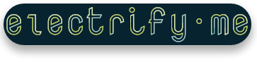

> Create a native-like app from a website. Just like that.

**electrify [me]**

`[ih-lek-truh-fahy]`

verb (used with a website), electrified, electrifying.

1. to run a website _[me]_ as native-like windows, mac or linux application.
2. to have available a website _[me]_ in your task bar, start menu or launchers.
3. to inject CSS into the website _[me]_ to change the appearance.

Example sentence: `Johnny would like to electrify whatsapp, so that it's available in his Windows task bar.`


## Usage

### Quick start

```
>> npm install
>> npm start -- https://web.whatsapp.com
```

### Options 

For details on options etc. run:

```
>> npm start -- -h

Usage:   <electrify> [URL] ([OPTS])

Options:
    -c <FILE>   CSS to be injected into website.
    -m          Window maximized.
    -d          Run in development mode.
    -r <FILE>   Read settings from local file (all other options are ignored).
    -w <FILE>   Write settings to local file.
    -h          Print this help.

Example: <electrify> https://web.whatsapp.com -c inject.css -d
```

### Settings file 

The setting files, that you can read/write via the options will look like this:

```
{
  "url": "https://web.whatsapp.com",
  "devMode": false,
  "maximized": false,
  "windowSettings": {
    "fullscreen": false,
    "fullscreenable": true,
    "resizable": true,
    "movable": true,
    "frame": true
  },
  "faviconUrl": "https://web.whatsapp.com/favicon.ico"
}
```

| Parameter | Purpose |
|-------------|------------|
| url | The URL you want to electrify |
| devMode | If  true, opens the chromium devevelopment console on startup |
| maximized | If true, opens the window maximized | 
| windowSettings | Fine-grained [Electron window settings](http://electron.atom.io/docs/api/browser-window/#new-browserwindowoptions) (Attention: Parameters icon, show, and webPreferences will always be overwritten) |
| faviconUrl | Auto-detected path to favicon of website |

## Licence and attributions

This small tool is powered by the awesome [Electron framework](http://electron.atom.io/).

Code is licensed under GPLv3.
