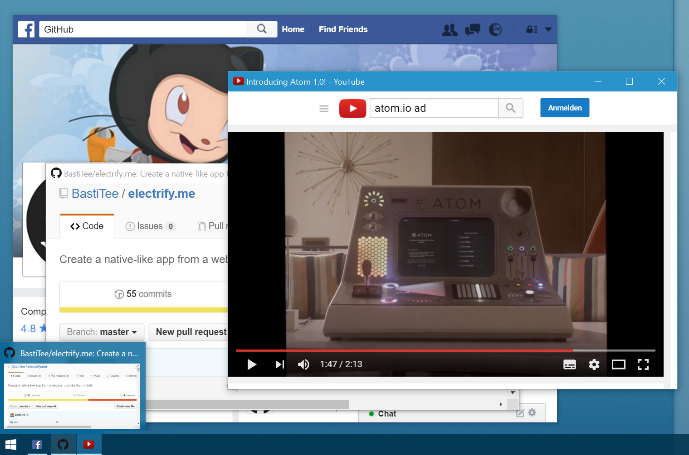

This project is discontinued. Use the awesome open-source project [Nativefier](https://github.com/jiahaog/nativefier) instead. It has the same basic idea, but a good community and it's in active development. 

---


> Create a native-like app from a website. Just like that.

[](https://github.com/BastiTee/electrify.me/releases/latest)
[](https://www.codacy.com/app/basti-tee/electrify-me?utm_source=github.com&amp;utm_medium=referral&amp;utm_content=BastiTee/electrify.me&amp;utm_campaign=Badge_Grade)

## About

*electrify.me* is a tool to run a website as native-like application. Electrified websites are available in your task bar, start menu or launchers. Just like a native application.

You can customize the apperance of your electrified website by injecting CSS into the website, start the app in kiosk mode, open it at specific window positions [and much more](http://electron.atom.io/docs/api/browser-window/#new-browserwindowoptions).



## Usage

Download source archive and, assuming you have node & npm installed – run..

```
./electrify https://web.whatsapp.com
```

### Startup process

A subfolder `_electrified` will be created, containing the extracted and converted favicons and a reusable settings file (see below).
Furthermore you will find a desktop link to restart your configured app and to add the link to your start menu or launcher bar.

### Options

For details on options etc. run `./electrify -h`.

```
Usage:   <electrify> [URL] ([OPTS])

Options:
    -c <FILE>   CSS to be injected into website.
    -m          Window maximized.
    -d          Run in development mode.
    -r <FILE>   Read settings from local file (all other options are ignored).
    -h          Print this help.

Example: <electrify> https://web.whatsapp.com -c inject.css -d
```

### Settings file

The setting file that you can read/write via the command-line options will look something like this:

```
{
  "url": "https://web.whatsapp.com",
  "cssFile": "my-css-injections.css",
  "devMode": false,
  "maximized": false,
  "hideScrollbars": false,
  "windowSettings": {
    "fullscreen": false,
    "fullscreenable": true,
    "resizable": true,
    "movable": true,
    "frame": true
  },
  "manualIcon": null
}
```

| Parameter | Purpose |
|-------------|------------|
| url | The URL you want to electrify |
| cssFile | The css file to be injected. Can either be an absolute path or filename only, if the cssFile resides next to the settings file. |
| devMode | If  true, opens the chromium devevelopment console on startup |
| maximized | If true, opens the window maximized |
| hideScrollbars | Tries to suppress window scrollbars |
| windowSettings | Fine-grained [Electron window settings](http://electron.atom.io/docs/api/browser-window/#new-browserwindowoptions) (Attention: Parameters icon, show, and webPreferences will always be overwritten) |
| manualIcon | Path to a manual icon to be set (in case electrify cannot determine a favicon) |

## Limitations and future work

*electrify.me* is in its baby shoes. Pull requests and ideas are very welcome.

### Current To-Dos

**Favicon extraction**

Favicon extraction is still somewhat shaky. The reason is that icon files are not supported by electron and that there is no non-native way to convert ico to png. Currently imagemagick/convert is used. So further work would include:

- [ ] Add an imagemagick build for linux systems to support ico-2-png conversion for it.
- [ ] Add an imagemagick build for mac systems to support ico-2-png conversion for it.

or

- [ ] Find a way to [convert ico files to pngs without imagemagick](http://stackoverflow.com/questions/37391106/convert-ico-icon-file-to-png-image-file-using-plain-javascript) (or other native dependencies)

or

- [ ] Wait for electron to [support ICO files](https://github.com/electron/electron/issues/2277)

**Installing**

- [ ] Create executable packages
- [ ] Create installer packages

**Other**

- [ ] Support for MAC (it's an electron app afterall, but I cannot test myself)
- [ ] Support for WIN (it's an electron app afterall, but I cannot test myself)

## Licence and attributions

Icon made by [Freepik](http://www.flaticon.com/authors/freepik) from [www.flaticon.com](http://www.flaticon.com/free-icon/light-bulb_125292)

Code is licensed under GPLv3.

This small tool is powered by the awesome [Electron framework](http://electron.atom.io/).
